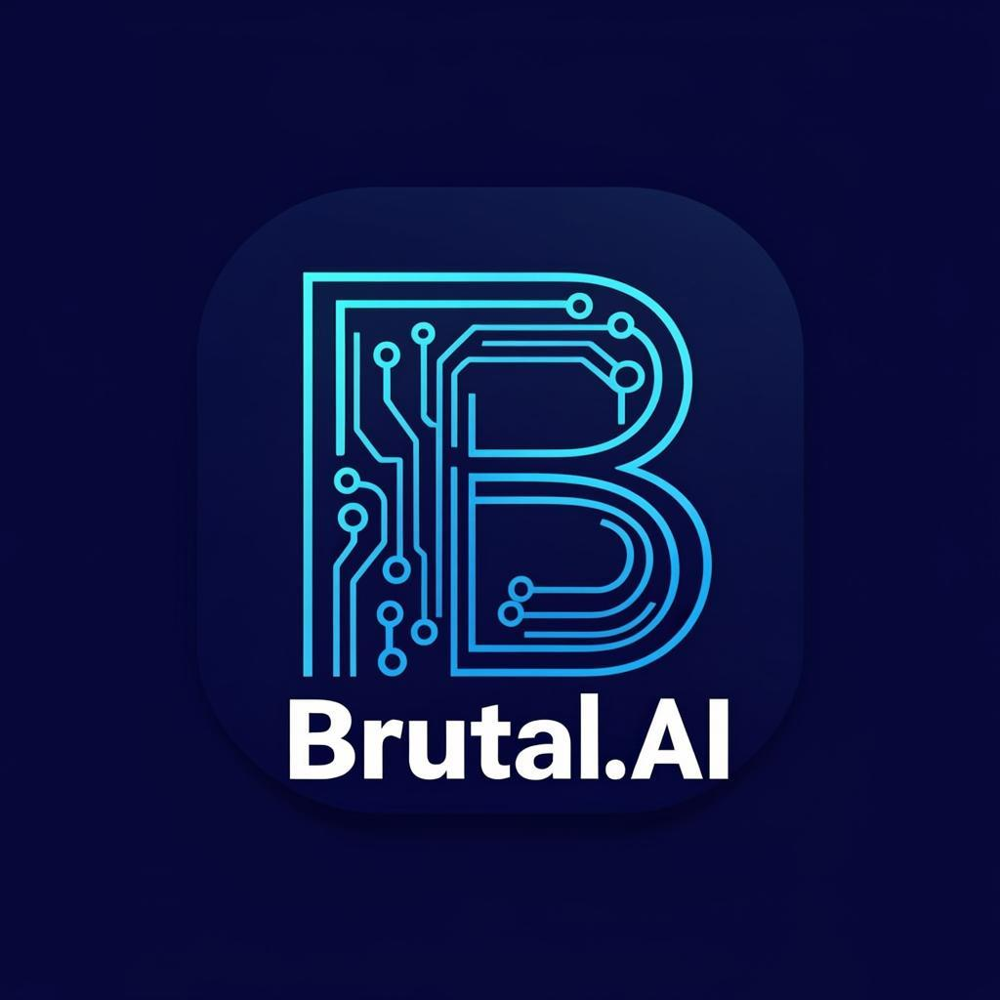

<div align="center">

# 🚀 Brutal.ai



### **Smarter. Faster. Brutal.**

**A world-class AI SaaS platform built with Next.js 16**

```diff
+ Premium landing page • Powerful AI chatbot • 24+ specialized AI tools • Enterprise-grade infrastructure
```

[](https://nextjs.org/)
[](https://www.typescriptlang.org/)
[](https://tailwindcss.com/)
[](https://www.framer.com/motion/)
[](LICENSE)

[](https://vercel.com/new/clone?repository-url=https://github.com/brutal-ai/brutal-ai)

</div>

---

## 📖 Table of Contents

```
┌─────────────────────────────────────────────────────────────┐
│  📖 NAVIGATION                                               │
├─────────────────────────────────────────────────────────────┤
│  → Overview           → Features        → Animations        │
│  → Tech Stack         → Project Structure → Quick Start     │
│  → Deploy             → API Docs        → Design System     │
│  → Platform Support   → Contributing    → License           │
└─────────────────────────────────────────────────────────────┘
```

- [Overview](#-overview)
- [Screenshots](#-screenshots)
- [Features](#-features)
- [Animations & Effects](#-animations--effects)
- [Tech Stack](#-tech-stack)
- [Project Structure](#-project-structure)
- [Quick Start](#-quick-start)
- [Deploy to Vercel](#-deploy-to-vercel)
- [API Documentation](#-api-documentation)
- [Design System](#-design-system)
- [Platform Support](#-platform-support)
- [Contributing](#-contributing)
- [License](#-license)

---

## ✨ Overview

```typescript
const brutalAI = {
  vision: "Next-generation AI platform",
  built_for: ["Developers", "Creators", "Businesses"],
  priorities: ["Speed", "Clarity", "Precision"],
  experience: "World-class"
};
```

Brutal.ai is a next-generation AI platform designed for developers, creators, and businesses who demand excellence. Experience the power of AI with a clean, professional interface that prioritizes speed, clarity, and precision.

### 🎯 Why Brutal.ai?

| Feature | Description | Status |
|---------|-------------|--------|
| 🌐 **World-Class Landing Page** | Premium SaaS design with 3D animations, gradient effects, and smooth transitions | ✅ |
| 💬 **Advanced AI Chat** | ChatGPT-style interface with markdown, code highlighting, voice input, and streaming | ✅ |
| 🛠️ **24+ AI Tools** | Specialized tools for creative, development, business, productivity, and language tasks | ✅ |
| 📱 **Mobile-First Design** | Responsive, touch-optimized interface that works everywhere | ✅ |
| ⚡ **Lightning Fast** | Optimized for performance with 60fps animations | ✅ |
| 🔒 **Enterprise-Ready** | Rate limiting, circuit breakers, connection pooling, and monitoring | ✅ |

---

## 🖼️ Screenshots

<table>
<tr>
<td width="50%" valign="top">

### 🏠 Landing Page
```
╔══════════════════════════════════╗
║  🌌 HERO SECTION                 ║
║  ├─ 3D Parallax Orbs             ║
║  ├─ Animated Grid Pattern        ║
║  ├─ Typewriter Code Panel        ║
║  └─ Floating Particles           ║
╠══════════════════════════════════╣
║  ✨ FEATURES SECTION             ║
║  ├─ 3D Tilt Cards                ║
║  ├─ Dynamic Spotlight            ║
║  └─ Border Glow Effects          ║
╠══════════════════════════════════╣
║  🚀 CTA SECTION                  ║
║  └─ Interactive Animations       ║
╚══════════════════════════════════╝
```

</td>
<td width="50%" valign="top">

### 💬 AI Chat Interface
```
╔══════════════════════════════════╗
║  💬 CHAT INTERFACE               ║
║  ├─ Code Syntax Highlighting     ║
║  ├─ Markdown Support (GFM)       ║
║  ├─ Streaming Responses          ║
║  ├─ Voice Input                  ║
║  └─ PDF/TXT Export               ║
╠══════════════════════════════════╣
║  🛠️ TOOLS HUB                    ║
║  ├─ 24+ AI Tools                 ║
║  ├─ Category Organization        ║
║  └─ Consistent UI/UX             ║
╠══════════════════════════════════╣
║  🎨 IMAGE GENERATION             ║
║  ├─ 12 Image Styles              ║
║  └─ Gallery & Favorites          ║
╚══════════════════════════════════╝
```

</td>
</tr>
</table>

---

## 🚀 Features

### 🌌 Hero Section - Next-Gen Animations

```
┌──────────────────────────────────────────────────────────────┐
│  ██████╗ ██╗   ██╗████████╗ ██████╗ ██████╗ ███████╗██╗     ██╗███╗   ██╗███████╗ │
│  ██╔══██╗██║   ██║╚══██╔══╝██╔═══██╗██╔══██╗██╔════╝██║     ██║████╗  ██║██╔════╝ │
│  ██████╔╝██║   ██║   ██║   ██║   ██║██████╔╝█████╗  ██║     ██║██╔██╗ ██║█████╗   │
│  ██╔══██╗██║   ██║   ██║   ██║   ██║██╔══██╗██╔══╝  ██║     ██║██║╚██╗██║██╔══╝   │
│  ██████╔╝╚██████╔╝   ██║   ╚██████╔╝██║  ██║███████╗███████╗██║██║ ╚████║███████╗ │
│  ╚═════╝  ╚═════╝    ╚═╝    ╚═════╝ ╚═╝  ╚═╝╚══════╝╚══════╝╚═╝╚═╝  ╚═══╝╚══════╝ │
└──────────────────────────────────────────────────────────────┘
```

| Effect | Description | Implementation |
|--------|-------------|----------------|
| 🌀 **3D Parallax Orbs** | Mouse-reactive floating orbs with depth movement | `useMotionValue`, `useSpring` |
| 📊 **Animated Grid** | Moving background grid for depth illusion | CSS `backgroundPosition` animation |
| ✨ **Particle Field** | 20+ dynamic floating particles | Random opacity/scale loops |
| 💻 **Typewriter Panel** | Real-time typing with syntax highlighting | Custom typewriter hook |
| 🎭 **Glitch Effect** | Cyberpunk character substitution | Random char replacement |
| 🔄 **Rotating Borders** | Gradient rings around terminal | `rotate: [0, 360]` |
| 💫 **Scan Lines** | Moving horizontal lines | `animate: { top: ['0%', '100%'] }` |
| 👑 **Floating Crown** | Animated premium indicator | Bounce + rotate animation |
| ✨ **Shimmer Effects** | Moving light on buttons | `x: ['-200%', '200%']` |

### ✨ Features Section - 3D Interactive Cards

| Feature | Technology | Performance |
|---------|------------|-------------|
| 🎯 **True 3D Tilt** | `perspective: 1200`, `rotateX/Y` | 60fps |
| 💡 **Dynamic Spotlight** | Radial gradient + mouse tracking | GPU accelerated |
| 🎈 **Floating Particles** | 5 particles per card on hover | Optimized loops |
| 🌟 **Icon Animations** | 3D rotation + pulsing glow | CSS transforms |
| 🔆 **Border Glow** | Inset + outer box-shadow | Hardware accelerated |
| ➡️ **Arrow Indicators** | Slide-in on hover | Spring physics |

### 💬 Advanced AI Chatbot

```
┌─────────────────────────────────────────────────────────────────┐
│                     💬 AI CHAT FEATURES                          │
├─────────────────────────────────────────────────────────────────┤
│  ┌─────────────────┐  ┌─────────────────┐  ┌─────────────────┐  │
│  │ 🎨 Syntax       │  │ 📝 Markdown     │  │ ⚡ Streaming    │  │
│  │ Highlighting    │  │ Support (GFM)   │  │ Responses       │  │
│  │ Prism.js        │  │ react-markdown  │  │ Real-time       │  │
│  └─────────────────┘  └─────────────────┘  └─────────────────┘  │
│  ┌─────────────────┐  ┌─────────────────┐  ┌─────────────────┐  │
│  │ 🎤 Voice Input  │  │ 📄 PDF Export   │  │ 🌓 Dark/Light   │  │
│  │ Web Speech API  │  │ jsPDF           │  │ System Detect   │  │
│  └─────────────────┘  └─────────────────┘  └─────────────────┘  │
└─────────────────────────────────────────────────────────────────┘
```

### 🛠️ AI Tools Hub (24+ Tools)

| Category | Tools | Count |
|----------|-------|-------|
| 🎨 **Creative** | Image Generator, Logo Maker, Background Remover, Thumbnail Creator, Poster Designer | 5 |
| 💻 **Developer** | Code Generator, Debugger, Website Builder, API Documentation Writer | 4 |
| 📈 **Business** | Business Plan, Marketing Strategy, Ad Copy Writer, Startup Name Generator, Business Name Generator | 5 |
| 🧑‍💼 **Productivity** | Resume Builder, Email Writer, PDF Summarizer, Notes Generator | 4 |
| 🌍 **Language** | Translator, Grammar Fixer, Text Rewriter, Tone Changer | 4 |

### 🏢 Enterprise-Grade Infrastructure

```
╔═══════════════════════════════════════════════════════════════╗
║  🏢 ENTERPRISE INFRASTRUCTURE                                  ║
╠═══════════════════════════════════════════════════════════════╣
║  ⚡ Rate Limiting      → Token bucket + sliding window        ║
║  🔗 Connection Pooling → Up to 100 concurrent connections     ║
║  🛡️ Circuit Breaker    → Automatic failure recovery           ║
║  📋 Request Queue      → Priority-based scheduling            ║
║  💾 Caching            → LRU cache for responses              ║
║  📊 Monitoring         → Real-time performance metrics        ║
║  📡 Streaming          → SSE for real-time responses          ║
╚═══════════════════════════════════════════════════════════════╝
```

---

## 🎨 Animations & Effects

### Premium Animation System

```
╔═══════════════════════════════════════════════════════════════════════╗
║                    🎨 ANIMATION SYSTEM ARCHITECTURE                    ║
╠═══════════════════════════════════════════════════════════════════════╣
║                                                                        ║
║  ┌──────────────┐   ┌──────────────┐   ┌──────────────┐              ║
║  │ 🌟 3D EFFECTS│   │ ✨ GLOW FX   │   │ 🔄 MOTION    │              ║
║  ├──────────────┤   ├──────────────┤   ├──────────────┤              ║
║  │ Perspective  │   │ Multi-layer  │   │ Spring Phys  │              ║
║  │ Parallax     │   │ Glow Rings   │   │ Infinite     │              ║
║  │ Depth Layer  │   │ Spotlight    │   │ Stagger      │              ║
║  │ Preserve-3d  │   │ Grad Borders │   │ Scroll-trig  │              ║
║  └──────────────┘   └──────────────┘   └──────────────┘              ║
║                                                                        ║
║  ┌──────────────┐   ┌──────────────┐   ┌──────────────┐              ║
║  │ 🎭 VISUAL FX │   │ 🎯 MICRO-INT │   │ ⚡ PERFORMANCE│              ║
║  ├──────────────┤   ├──────────────┤   ├──────────────┤              ║
║  │ Glitch       │   │ Button Press │   │ GPU accel    │              ║
║  │ Scan Lines   │   │ Card Tilt    │   │ will-change  │              ║
║  │ Shimmer      │   │ Icon Spin    │   │ Debounce     │              ║
║  │ Particles    │   │ Text Reveal  │   │ Intersection │              ║
║  │ Noise        │   │ Arrow Bounce │   │ Reduced mot  │              ║
║  └──────────────┘   └──────────────┘   └──────────────┘              ║
║                                                                        ║
╚═══════════════════════════════════════════════════════════════════════╝
```

### 3D Effects Implementation

| Effect | CSS/JS Property | Value Range |
|--------|-----------------|-------------|
| **Perspective** | `perspective` | `1000-1200px` |
| **Rotate X** | `rotateX` | `-25° to 25°` |
| **Rotate Y** | `rotateY` | `-25° to 25°` |
| **Translate Z** | `translateZ` | `20-50px` |
| **Transform Style** | `transform-style` | `preserve-3d` |

### Glow & Light Effects

| Effect | Implementation | Duration |
|--------|---------------|----------|
| **Multi-layer Glow** | Stacked `blur()` filters | Static |
| **Animated Glow Rings** | `box-shadow` animation | 2s infinite |
| **Spotlight Effect** | `radial-gradient` + mouse | Real-time |
| **Gradient Borders** | `conic-gradient` rotation | 6s infinite |
| **Box Shadow Animations** | `box-shadow` keyframes | 2.5s infinite |

### Performance Optimizations

```javascript
// Animation Performance Stack
const performanceConfig = {
  transforms: "GPU-accelerated CSS transforms",
  hints: "will-change for GPU optimization", 
  tracking: "Debounced mouse tracking",
  detection: "Intersection Observer for scroll",
  accessibility: "Reduced motion support"
};
```

---

## 🏗️ Tech Stack

<table>
<tr>
<th colspan="2" align="center">🔧 CORE FRAMEWORK</th>
</tr>
<tr>
<td width="50%">

[](https://nextjs.org/)

**React framework with App Router**

</td>
<td width="50%">

[](https://www.typescriptlang.org/)

**Type-safe JavaScript**

</td>
</tr>
<tr>
<td>

[](https://tailwindcss.com/)

**Utility-first CSS framework**

</td>
<td>

[](https://www.framer.com/motion/)

**Production-ready animations**

</td>
</tr>
</table>

<table>
<tr>
<th colspan="3" align="center">📦 DEPENDENCIES</th>
</tr>
<tr>
<td align="center">🎨 UI</td>
<td align="center">📝 Markdown</td>
<td align="center">🗃️ Utilities</td>
</tr>
<tr>
<td>

Lucide Icons

Next Themes

</td>
<td>

react-markdown

syntax-highlighter

</td>
<td>

jsPDF

</td>
</tr>
</table>

---

## 📁 Project Structure

```
╔══════════════════════════════════════════════════════════════════════════════╗
║                              📁 BRUTAL.AI PROJECT                             ║
╚══════════════════════════════════════════════════════════════════════════════╝

brutal-ai/
│
├── 📂 public/                          # Static Assets
│   ├── 🖼️ logo.png                     # AI-generated brand logo
│   └── 📄 favicon.ico                  # Browser favicon
│
├── 📂 src/                             # Source Code
│   │
│   ├── 📂 app/                         # Next.js App Router
│   │   │
│   │   ├── 📂 api/                     # API Routes
│   │   │   │
│   │   │   ├── 📂 chat/                # 💬 Chat API
│   │   │   │   └── route.ts            #   └─ Streaming support, rate limiting
│   │   │   │
│   │   │   ├── 📂 image/               # 🎨 Image Generation API
│   │   │   │   └── route.ts            #   └─ 12 styles, multiple sizes
│   │   │   │
│   │   │   ├── 📂 health/              # 🏥 Health Check
│   │   │   │   └── route.ts            #   └─ System status endpoint
│   │   │   │
│   │   │   ├── 📂 monitoring/          # 📊 Monitoring Dashboard
│   │   │   │   └── route.ts            #   └─ Performance metrics
│   │   │   │
│   │   │   └── 📂 tools/               # 🛠️ Tool API Endpoints (24+)
│   │   │       ├── 📂 code/            #   ├─ Code Generator
│   │   │       ├── 📂 debug/           #   ├─ Code Debugger
│   │   │       ├── 📂 business-plan/   #   ├─ Business Plan Writer
│   │   │       ├── 📂 email/           #   ├─ Email Writer
│   │   │       ├── 📂 translate/       #   ├─ Translator
│   │   │       ├── 📂 grammar/         #   ├─ Grammar Fixer
│   │   │       ├── 📂 resume/          #   ├─ Resume Builder
│   │   │       ├── 📂 marketing/       #   ├─ Marketing Strategy
│   │   │       └── ...                 #   └─ And 16+ more tools
│   │   │
│   │   ├── 🎨 globals.css              # Global Styles
│   │   │                               #   ├─ CSS Variables
│   │   │                               #   ├─ Animation Keyframes
│   │   │                               #   ├─ Glass Morphism Classes
│   │   │                               #   └─ Gradient Mesh Effects
│   │   │
│   │   ├── 📄 layout.tsx               # Root Layout
│   │   │                               #   ├─ Theme Provider
│   │   │                               #   └─ Global Providers
│   │   │
│   │   └── 📄 page.tsx                 # Main Application
│   │                                   #   ├─ View Routing
│   │                                   #   ├─ Landing Page
│   │                                   #   ├─ Chat Interface
│   │                                   #   ├─ Tool Workspace
│   │                                   #   └─ Image Generator
│   │
│   ├── 📂 components/                  # React Components
│   │   │
│   │   ├── 📂 chat/                    # 💬 Chat Components
│   │   │   ├── ChatMessage.tsx         #   ├─ Message with markdown & code
│   │   │   ├── InputBar.tsx            #   ├─ Input with voice & file support
│   │   │   ├── TypingIndicator.tsx     #   ├─ Animated typing dots
│   │   │   ├── Sidebar.tsx             #   ├─ Conversation sidebar
│   │   │   └── ToolsSheet.tsx          #   └─ Tools slide-out panel
│   │   │
│   │   ├── 📂 landing/                 # 🌐 Landing Page Components
│   │   │   │
│   │   │   ├── Hero.tsx                #   ├─ 🌌 Hero Section
│   │   │   │                           #   │   ├─ 3D Parallax Orbs
│   │   │   │                           #   │   ├─ Particle Field
│   │   │   │                           #   │   ├─ Typewriter Terminal
│   │   │   │                           #   │   ├─ Glitch Effects
│   │   │   │                           #   │   └─ Animated Stats Cards
│   │   │   │
│   │   │   ├── Features.tsx            #   ├─ ✨ Features Section
│   │   │   │                           #   │   ├─ 3D Tilt Cards
│   │   │   │                           #   │   ├─ Dynamic Spotlight
│   │   │   │                           #   │   └─ Floating Particles
│   │   │   │
│   │   │   ├── AIDemo.tsx              #   ├─ 🧠 Live AI Demo
│   │   │   │                           #   │   ├─ Terminal Animation
│   │   │   │                           #   │   └─ Code Highlighting
│   │   │   │
│   │   │   ├── Stats.tsx               #   ├─ 📊 Statistics
│   │   │   │                           #   │   └─ Count-up Animation
│   │   │   │
│   │   │   ├── Downloads.tsx           #   ├─ 📥 Download Section
│   │   │   │                           #   │   ├─ Device Detection
│   │   │   │                           #   │   └─ QR Code Generation
│   │   │   │
│   │   │   ├── ToolsHub.tsx            #   ├─ 🛠️ Tools Preview
│   │   │   │                           #   │   └─ Tool Categories Grid
│   │   │   │
│   │   │   └── CTA.tsx                 #   └─ 🚀 Call to Action
│   │   │                               #       ├─ 3D Tilt Container
│   │   │                               #       ├─ Particle Effects
│   │   │                               #       └─ Shimmer Buttons
│   │   │
│   │   ├── 📂 splash/                  # 🎬 Splash Screen
│   │   │   └── SplashScreen.tsx        #   └─ Animated logo reveal
│   │   │
│   │   ├── 📂 tools/                   # 🛠️ Tool Components
│   │   │   ├── ImageGenerator.tsx      #   ├─ Image Generation UI
│   │   │   │                           #   │   ├─ Style Selector
│   │   │   │                           #   │   ├─ Aspect Ratio Picker
│   │   │   │                           #   │   └─ Gallery View
│   │   │   │
│   │   │   ├── ImageToolsHub.tsx       #   ├─ Image Editing Tools
│   │   │   │                           #   │   ├─ Upscaler
│   │   │   │                           #   │   ├─ Background Remover
│   │   │   │                           #   │   └─ Style Transfer
│   │   │   │
│   │   │   ├── ToolWorkspace.tsx       #   ├─ Generic Tool Workspace
│   │   │   │                           #   │   ├─ Input Area
│   │   │   │                           #   │   ├─ Output Preview
│   │   │   │                           #   │   └─ History Tab
│   │   │   │
│   │   │   └── TypewriterPreview.tsx   #   └─ Typewriter Text Effect
│   │   │
│   │   └── 📂 ui/                      # 🎨 shadcn/ui Components
│   │       ├── button.tsx              #   ├─ Button variants
│   │       ├── input.tsx               #   ├─ Input field
│   │       ├── textarea.tsx            #   ├─ Textarea
│   │       ├── badge.tsx               #   ├─ Badge component
│   │       ├── sheet.tsx               #   ├─ Sheet/Drawer
│   │       ├── tabs.tsx                #   ├─ Tabs component
│   │       ├── toast.tsx               #   ├─ Toast notifications
│   │       └── ...                     #   └─ And more UI components
│   │
│   ├── 📂 lib/                         # Utility Libraries
│   │   │
│   │   ├── 📂 api/                     # API Infrastructure
│   │   │   ├── config.ts               #   ├─ Configuration management
│   │   │   ├── rate-limiter.ts         #   ├─ Token bucket algorithm
│   │   │   ├── cache.ts                #   ├─ LRU cache implementation
│   │   │   ├── monitoring.ts           #   ├─ Performance metrics
│   │   │   └── connection-pool.ts      #   └─ Connection management
│   │   │
│   │   ├── db.ts                       # Database configuration
│   │   └── utils.ts                    # Utility functions
│   │                                   #   ├─ cn() class merger
│   │                                   #   └─ Formatting helpers
│   │
│   ├── 📂 store/                       # State Management
│   │   ├── app-store.ts                #   ├─ App state
│   │   │                               #   │   ├─ currentView
│   │   │                               #   │   └─ selectedToolId
│   │   │
│   │   └── chat-store.ts               #   └─ Chat state
│   │                                   #       ├─ conversations
│   │                                   #       ├─ messages
│   │                                   #       └─ isTyping
│   │
│   ├── 📂 hooks/                       # Custom React Hooks
│   │   └── use-toast.ts                #   └─ Toast notification hook
│   │
│   └── 📂 types/                       # TypeScript Types
│       └── chat.ts                     #   ├─ Message types
│                                       #   ├─ Tool types
│                                       #   ├─ Conversation types
│                                       #   └─ API response types
│
├── 📄 package.json                     # Dependencies & Scripts
├── 📄 tailwind.config.ts               # Tailwind Configuration
│                                       #   ├─ Custom colors
│                                       #   ├─ Animation keyframes
│                                       #   └─ Plugin configuration
│
├── 📄 tsconfig.json                    # TypeScript Configuration
├── 📄 next.config.ts                   # Next.js Configuration
├── 📄 vercel.json                      # Vercel Deployment Config
│                                       #   ├─ Security headers
│                                       #   └─ Build settings
│
└── 📄 README.md                        # Project Documentation
```

### 📊 File Statistics

| Category | Files | Description |
|----------|-------|-------------|
| 📂 **API Routes** | 30+ | Chat, Image, Tools endpoints |
| ⚛️ **Components** | 40+ | React components |
| 🎨 **Styles** | 1 | Global CSS with animations |
| 📝 **Types** | 1 | TypeScript definitions |
| 🗃️ **Store** | 2 | State management |
| 🛠️ **Utils** | 5+ | Utility functions |

---

## 🚀 Quick Start

### Prerequisites

```bash
# Required versions
Node.js >= 18.0.0
Bun >= 1.0.0  # Recommended
```

### ⚡ Installation

```bash
# ━━━━━━━━━━━━━━━━━━━━━━━━━━━━━━━━━━━━━━━━━━━━━━━━
# 🚀 CLONE & SETUP
# ━━━━━━━━━━━━━━━━━━━━━━━━━━━━━━━━━━━━━━━━━━━━━━━━

# Clone the repository
git clone https://github.com/brutal-ai/brutal-ai.git

# Navigate to project
cd brutal-ai

# Install dependencies
bun install

# ━━━━━━━━━━━━━━━━━━━━━━━━━━━━━━━━━━━━━━━━━━━━━━━━
# 🏃 START DEVELOPMENT
# ━━━━━━━━━━━━━━━━━━━━━━━━━━━━━━━━━━━━━━━━━━━━━━━━

# Start development server
bun run dev

# Open in browser
# → http://localhost:3000
```

### 🏗️ Build for Production

```bash
# ━━━━━━━━━━━━━━━━━━━━━━━━━━━━━━━━━━━━━━━━━━━━━━━━
# 📦 PRODUCTION BUILD
# ━━━━━━━━━━━━━━━━━━━━━━━━━━━━━━━━━━━━━━━━━━━━━━━━

# Build the application
bun run build

# Start production server
bun start

# ━━━━━━━━━━━━━━━━━━━━━━━━━━━━━━━━━━━━━━━━━━━━━━━━
# 🔍 QUALITY CHECKS
# ━━━━━━━━━━━━━━━━━━━━━━━━━━━━━━━━━━━━━━━━━━━━━━━━

# Run ESLint
bun run lint
```

---

## ▲ Deploy to Vercel

### One-Click Deploy

<div align="center">

[](https://vercel.com/new/clone?repository-url=https://github.com/brutal-ai/brutal-ai)

</div>

### Manual Deployment

```
┌─────────────────────────────────────────────────────────────────┐
│  ▲ VERCEL DEPLOYMENT STEPS                                       │
├─────────────────────────────────────────────────────────────────┤
│                                                                  │
│  1️⃣  FORK & CLONE                                               │
│      git clone https://github.com/YOUR_USERNAME/brutal-ai.git   │
│                                                                  │
│  2️⃣  CREATE VERCEL PROJECT                                       │
│      → Go to vercel.com                                          │
│      → Click "Add New..." → "Project"                            │
│      → Import your GitHub repository                             │
│                                                                  │
│  3️⃣  CONFIGURE SETTINGS                                          │
│      ┌─────────────────┬─────────────────────┐                  │
│      │ Framework       │ Next.js (auto)      │                  │
│      │ Build Command   │ bun run build       │                  │
│      │ Install Command │ bun install         │                  │
│      │ Output Dir      │ .next               │                  │
│      └─────────────────┴─────────────────────┘                  │
│                                                                  │
│  4️⃣  DEPLOY                                                      │
│      Click "Deploy" → Wait for build → Done! 🎉                  │
│                                                                  │
│  🌐 Your app: https://your-project.vercel.app                   │
│                                                                  │
└─────────────────────────────────────────────────────────────────┘
```

### Vercel Configuration

| Feature | Setting |
|---------|---------|
| 🔒 **Security Headers** | CORS, XSS Protection, Frame Protection |
| ⚡ **Build Runtime** | Bun for faster builds |
| 🔄 **Auto Deploy** | Push to main triggers deploy |
| 👁️ **Preview** | PR deployments enabled |

---

## 📚 API Documentation

### Endpoints Overview

```
╔═══════════════════════════════════════════════════════════════╗
║  📡 API ENDPOINTS                                               ║
╠═══════════════════════════════════════════════════════════════╣
║                                                                ║
║  ┌───────────────┬────────┬─────────────────────────────────┐ ║
║  │ Endpoint      │ Method │ Description                     │ ║
║  ├───────────────┼────────┼─────────────────────────────────┤ ║
║  │ /api/chat     │ POST   │ AI chat with streaming support  │ ║
║  │ /api/image    │ POST   │ Image generation with styles    │ ║
║  │ /api/health   │ GET    │ Health check endpoint           │ ║
║  │ /api/monitor  │ GET    │ System metrics (admin only)     │ ║
║  │ /api/tools/*  │ POST   │ 24+ specialized tool endpoints  │ ║
║  └───────────────┴────────┴─────────────────────────────────┘ ║
║                                                                ║
╚═══════════════════════════════════════════════════════════════╝
```

### 💬 Chat API

```typescript
// ═══════════════════════════════════════════════════════════════
// POST /api/chat
// ═══════════════════════════════════════════════════════════════

// Request Body
{
  "messages": [
    { "role": "user", "content": "Hello!" }
  ],
  "stream": true,           // Enable streaming (optional)
  "temperature": 0.7,       // Creativity level (0-2)
  "maxTokens": 4096         // Max response length
}

// ═══════════════════════════════════════════════════════════════
// Response (Non-streaming)
// ═══════════════════════════════════════════════════════════════

{
  "response": "Hello! How can I assist you today?"
}

// ═══════════════════════════════════════════════════════════════
// Response (Streaming)
// ═══════════════════════════════════════════════════════════════

data: {"content": "Hello"}
data: {"content": "!"}
data: {"content": " How"}
data: {"content": " can"}
data: {"content": " I"}
data: {"content": " help?"}
data: [DONE]
```

### 🎨 Image Generation API

```typescript
// ═══════════════════════════════════════════════════════════════
// POST /api/image
// ═══════════════════════════════════════════════════════════════

// Request Body
{
  "prompt": "A beautiful sunset over mountains",
  "size": "1024x1024",          // See size options below
  "style": "realistic",         // 12 styles available
  "aspectRatio": "16:9",        // Optional: override size
  "resolution": "hd",           // hd, 2k, 4k
  "lighting": "cinematic",      // Lighting style
  "colorTone": "vibrant",       // Color palette
  "count": 1                    // Number of images (1-10)
}

// ═══════════════════════════════════════════════════════════════
// Response
// ═══════════════════════════════════════════════════════════════

{
  "image": "data:image/png;base64,iVBORw0KGgo...",
  "success": true,
  "metadata": {
    "prompt": "enhanced prompt...",
    "size": "1024x1024",
    "style": "realistic"
  }
}

// Multiple images response
{
  "images": ["data:image/png;base64,...", ...],
  "count": 4,
  "requested": 4,
  "success": true
}
```

### 📐 Valid Image Sizes

```
┌─────────────────────────────────────────────────────────────────┐
│  📐 IMAGE SIZE OPTIONS                                           │
├────────────────┬────────────────┬───────────────────────────────┤
│  Size          │ Aspect Ratio   │ Best For                      │
├────────────────┼────────────────┼───────────────────────────────┤
│  1024x1024     │ 1:1 (Square)   │ Social media, avatars         │
│  1344x768      │ 16:9 HD        │ YouTube thumbnails            │
│  1440x720      │ 21:9 Cinematic │ Banners, headers              │
│  768x1344      │ 9:16 Portrait  │ Stories, mobile               │
│  720x1440      │ 9:16 4K        │ High-quality stories          │
│  1152x864      │ 4:3 Standard   │ Presentations                 │
│  864x1152      │ 3:4 Portrait   │ Posters, documents            │
└────────────────┴────────────────┴───────────────────────────────┘
```

### 🎨 Image Styles

```
┌─────────────────────────────────────────────────────────────────┐
│  🎨 AVAILABLE IMAGE STYLES                                       │
├────────────────┬────────────────────────────────────────────────┤
│  realistic     │ Photorealistic, ultra detailed, professional  │
│  cinematic     │ Movie still, dramatic lighting, film grain    │
│  anime         │ Anime style, cel shaded, vibrant              │
│  3d            │ 3D render, octane render, ray tracing         │
│  digital-art   │ Digital art, artstation trending, concept art │
│  pixel-art     │ Pixel art, 16-bit style, retro game           │
│  logo          │ Minimalist logo, vector style, professional   │
│  thumbnail     │ YouTube thumbnail, eye-catching, bold colors  │
│  poster        │ Movie poster style, graphic design            │
│  ui-mockup     │ UI design mockup, clean modern interface      │
│  product       │ Product photography, studio lighting          │
│  concept       │ Concept art, matte painting, epic scale       │
└────────────────┴────────────────────────────────────────────────┘
```

### 🛠️ Tool APIs

```typescript
// ═══════════════════════════════════════════════════════════════
// Tool Endpoint Pattern: POST /api/tools/{tool-name}
// ═══════════════════════════════════════════════════════════════

// Example: Code Generator
POST /api/tools/code
{
  "prompt": "Create a React hook for fetching data"
}

// Example: Translator
POST /api/tools/translate
{
  "prompt": "Hello, how are you?",
  "targetLanguage": "Spanish"
}

// Example: Email Writer
POST /api/tools/email
{
  "prompt": "Write a follow-up email after a job interview"
}

// ═══════════════════════════════════════════════════════════════
// Available Tool Endpoints
// ═══════════════════════════════════════════════════════════════

// Developer Tools
/api/tools/code          // Code Generator
/api/tools/debug         // Code Debugger
/api/tools/website       // Website Builder
/api/tools/api-docs      // API Documentation Writer

// Business Tools
/api/tools/business-plan // Business Plan Generator
/api/tools/business-name // Business Name Generator
/api/tools/marketing     // Marketing Strategy
/api/tools/ad-copy       // Ad Copy Writer
/api/tools/startup-name  // Startup Name Generator

// Productivity Tools
/api/tools/resume        // Resume Builder
/api/tools/email         // Email Writer
/api/tools/pdf-summary   // PDF Summarizer
/api/tools/notes         // Notes Generator

// Language Tools
/api/tools/translate     // Translator
/api/tools/grammar       // Grammar Fixer
/api/tools/rewrite       // Text Rewriter
/api/tools/tone-changer  // Tone Changer

// Image Tools
/api/tools/logo          // Logo Generator
/api/tools/thumbnail     // Thumbnail Creator
/api/tools/poster-designer // Poster Designer
```

---

## 🎨 Design System

### 🎨 Color Palette

```
╔═══════════════════════════════════════════════════════════════╗
║  🎨 COLOR PALETTE                                               ║
╠═══════════════════════════════════════════════════════════════╣
║                                                                ║
║  LIGHT MODE                    DARK MODE                       ║
║  ──────────────────────────    ──────────────────────────      ║
║  Background:  #F9FAFB          Background:  #0F172A            ║
║  Foreground:  #1e293b          Foreground:  #f1f5f9            ║
║  Primary:     #6C5CE7          Primary:     #8b5cf6            ║
║  Accent:      #E9E5FF          Accent:      #4c1d95            ║
║  Muted:       #F1F5F9          Muted:       #1e293b            ║
║                                                                ║
╚═══════════════════════════════════════════════════════════════╝
```

### 🌈 Gradient Colors

| Gradient | Colors | Usage |
|----------|--------|-------|
| **Primary** | `#3b82f6` → `#8b5cf6` → `#06b6d4` | Buttons, text effects |
| **Warm** | `#f59e0b` → `#ef4444` | Warnings, highlights |
| **Success** | `#28c840` | Status indicators |
| **Warning** | `#febc2e` | Caution states |
| **Error** | `#ff5f57` | Error states |

### 🎭 Animation Classes

```css
/* ━━━━━━━━━━━━━━━━━━━━━━━━━━━━━━━━━━━━━━━━━━━━━━━━
   CSS Animation Classes
   ━━━━━━━━━━━━━━━━━━━━━━━━━━━━━━━━━━━━━━━━━━━━━━━━ */

.glass-3d {
  /* Glass morphism with 3D depth */
  backdrop-filter: blur(20px);
  background: rgba(255, 255, 255, 0.05);
  border: 1px solid rgba(255, 255, 255, 0.1);
  box-shadow: 0 8px 32px rgba(0, 0, 0, 0.3);
}

.shadow-3d {
  /* Multi-layered 3D shadow */
  box-shadow: 
    0 2px 4px rgba(0, 0, 0, 0.1),
    0 8px 16px rgba(0, 0, 0, 0.1),
    0 16px 32px rgba(0, 0, 0, 0.15);
}

.text-gradient-animated {
  /* Moving gradient text */
  background: linear-gradient(90deg, #3b82f6, #8b5cf6, #06b6d4);
  background-size: 200% 200%;
  -webkit-background-clip: text;
  animation: gradient-shift 5s ease infinite;
}

.btn-3d {
  /* 3D interactive button */
  transform-style: preserve-3d;
  transition: transform 0.3s ease;
}

.btn-3d:hover {
  transform: perspective(1000px) rotateY(5deg);
}

.gradient-mesh {
  /* Animated background mesh */
  background: 
    radial-gradient(at 40% 20%, rgba(59, 130, 246, 0.3) 0px, transparent 50%),
    radial-gradient(at 80% 0%, rgba(139, 92, 246, 0.3) 0px, transparent 50%),
    radial-gradient(at 0% 50%, rgba(6, 182, 212, 0.3) 0px, transparent 50%);
  animation: mesh-move 20s ease infinite;
}
```

---

## 📱 Platform Support

```
┌─────────────────────────────────────────────────────────────────┐
│  📱 PLATFORM AVAILABILITY                                        │
├────────────────┬────────────┬───────────────────────────────────┤
│  Platform      │ Format     │ Status                            │
├────────────────┼────────────┼───────────────────────────────────┤
│  🌐 Web        │ PWA        │ ✅ Available Now                  │
│  🤖 Android    │ APK        │ 🔄 Coming Soon                    │
│  🍎 iOS        │ IPA        │ 🔄 Coming Soon                    │
│  🪟 Windows    │ EXE        │ 🔄 Coming Soon                    │
│  🍎 macOS      │ DMG        │ 🔄 Coming Soon                    │
│  🐧 Linux      │ AppImage   │ 🔄 Coming Soon                    │
└────────────────┴────────────┴───────────────────────────────────┘
```

---

## 🤝 Contributing

```bash
# ━━━━━━━━━━━━━━━━━━━━━━━━━━━━━━━━━━━━━━━━━━━━━━━━
# 🤝 CONTRIBUTION WORKFLOW
# ━━━━━━━━━━━━━━━━━━━━━━━━━━━━━━━━━━━━━━━━━━━━━━━━

# 1. Fork the repository
# 2. Create feature branch
git checkout -b feature/AmazingFeature

# 3. Make your changes
# 4. Commit with meaningful message
git commit -m 'Add some AmazingFeature'

# 5. Push to branch
git push origin feature/AmazingFeature

# 6. Open Pull Request
```

### Code Style Guidelines

- ✅ Follow existing code style
- ✅ Run `bun run lint` before committing
- ✅ Write meaningful commit messages
- ✅ Add comments for complex logic

---

## 📄 License

This project is licensed under the **MIT License**.

```
MIT License

Copyright (c) 2024 Brutal.ai

Permission is hereby granted, free of charge, to any person obtaining a copy
of this software and associated documentation files (the "Software"), to deal
in the Software without restriction, including without limitation the rights
to use, copy, modify, merge, publish, distribute, sublicense, and/or sell
copies of the Software, and to permit persons to whom the Software is
furnished to do so, subject to the following conditions:

The above copyright notice and this permission notice shall be included in all
copies or substantial portions of the Software.
```

---

<div align="center">

### **DEVELOPED UNDER BRUTALTOOLS**

**Made with ❤️ by the Brutal.ai Team**

[](https://brutal.ai)

[⬆ Back to Top](#-brutalai)

</div>
